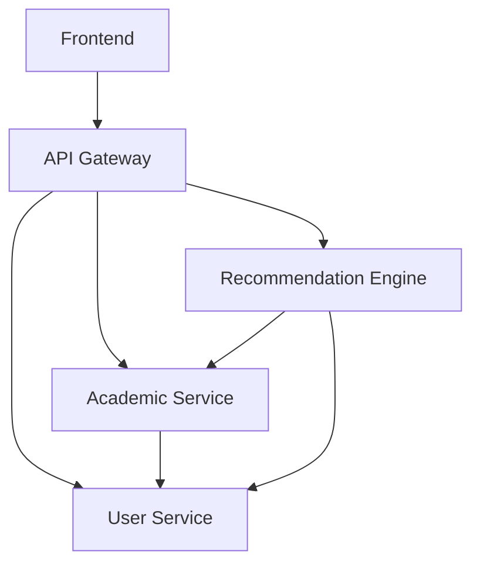

# Next Step 🎓

An AI-powered educational and career pathway recommendation system that helps students make informed decisions about their academic and career paths. Built with React frontend and Spring Boot microservices backend.

## 🌟 System Architecture

### Authentication & Security
- Firebase Authentication for secure user management
- JWT token validation across microservices
- Role-based access control
- API Gateway for centralized security

### Service Communication
- REST APIs for synchronous requests
- Event-driven architecture for asynchronous operations
- Service discovery via Spring Cloud Netflix
- Circuit breakers for fault tolerance

## 🚀 Microservices

The project follows a microservices architecture with the following components:

### Core Services
1. **API Gateway** (`next-step-gateway`)
   - Route management
   - Authentication validation
   - Rate limiting
   - Load balancing

2. **User Service** (`next-step-users`)
   - Firebase authentication integration
   - User profile management
   - Role-based authorization
   - User preferences

3. **Academic Service** (`next-step-academic`)
   - Educational institution data
   - Course management
   - Academic performance tracking
   - Stream recommendations

4. **Recommendation Engine** (`next-step-recommendations`)
   - AI/ML models for career prediction
   - Skills analysis
   - Course compatibility
   - Success probability calculation

5. **Frontend** (`next-step-frontend`)
   - React-based UI
   - Material-UI components
   - Responsive design
   - Progressive Web App

### Service Dependencies


## 🛠️ Tech Stack

### Frontend
- React + Vite
- Firebase Authentication
- React Router
- Material-UI
- Progressive Web App

### Backend
- Spring Boot
- Spring Cloud
- PostgreSQL
- Redis Cache
- Firebase Admin SDK

### DevOps
- Docker
- Kubernetes
- GitHub Actions
- ELK Stack

## 🚀 Getting Started

### Prerequisites
- Node.js (v18+)
- Java 17
- Docker & Docker Compose
- Firebase Project
- PostgreSQL

### Local Development Setup

1. **Clone with submodules**:
   ```bash
   git clone --recursive https://github.com/AdithyaSean/Next-Step.git
   cd Next-Step
   ```

2. **Environment Setup**:
   ```bash
   # Copy example env files
   cp .env.example .env
   cd next-step-frontend && cp .env.example .env
   ```

3. **Firebase Setup**:
   - Create a Firebase project
   - Enable Authentication
   - Download service account key
   - Place in appropriate service directories

4. **Start Services**:
   ```bash
   # Start infrastructure
   docker-compose up -d

   # Start backend services
   ./mvnw spring-boot:run -pl next-step-gateway
   ./mvnw spring-boot:run -pl next-step-users
   ./mvnw spring-boot:run -pl next-step-academic
   ./mvnw spring-boot:run -pl next-step-recommendations

   # Start frontend
   cd next-step-frontend
   yarn install
   yarn dev
   ```

## 📊 Monitoring & Logging

- ELK Stack for centralized logging
- Prometheus & Grafana for metrics
- Jaeger for distributed tracing
- Spring Actuator for health checks

## 🔄 CI/CD Pipeline

1. **Build & Test**:
   - Unit tests
   - Integration tests
   - Code coverage
   - Static analysis

2. **Security**:
   - SAST scanning
   - Dependency checking
   - Docker image scanning

3. **Deployment**:
   - Environment promotion
   - Blue-green deployment
   - Automated rollbacks
   - Health checks

## 📝 Documentation

Detailed documentation available in `/docs`:
- [Architecture Overview](docs/architecture.md)
- [Data Models](docs/data-model.md)
- [Microservices](docs/microservices.md)
- [Development Roadmap](docs/roadmap.md)

## 🤝 Contributing

1. Fork the repository
2. Create feature branch (`git checkout -b feature/AmazingFeature`)
3. Commit changes (`git commit -m 'Add AmazingFeature'`)
4. Push to branch (`git push origin feature/AmazingFeature`)
5. Open a Pull Request

## 📄 License

This project is licensed under the MIT License - see the [LICENSE](LICENSE) file for details.
